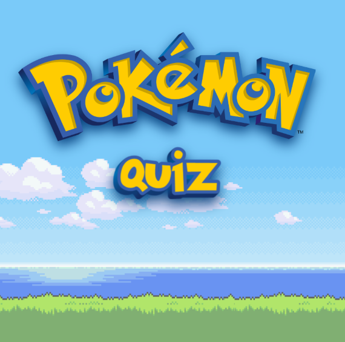

# Quiz Project - The Bridge #

## Introduction ##

Welcome to my Pokémon Quiz! (**In spanish**)

-------------------------------------------------------------------------------

## What's inside this project? ##

- HTML: A form containing 10 questions about Pokémon, Pokémon soundtrack and a section with the results and correct answers.
- CSS: Media querys from a mobile first desing with styles and animations inspired in old Pokémon games.
- Javascript: Functions, event listeners and a form validation, with all this you'll know if your answer was the right one and the total of correct answers!

-------------------------------------------------------------------------------

## I hope you'll enjoy it and get as many as you can in your first try ##

